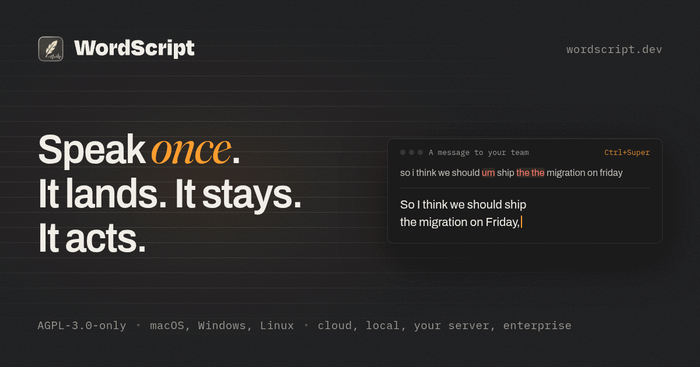
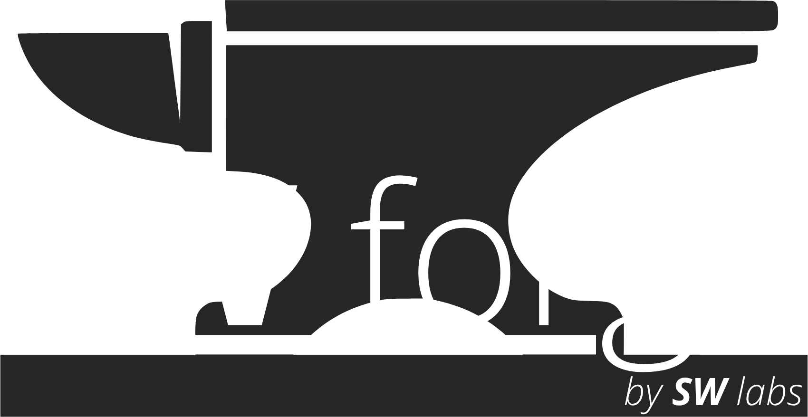

# WordScript

WordScript is a community-built desktop dictation app for one job: trigger
recording, speak, and return usable text to the current text field without
breaking writing flow. It is built in public by SW forge, the open-source brand
of SW labs.

## Current Status

- Version: `0.2.2-alpha`
- Usable today: source-first development build via `npm run tauri dev`
- In progress: internal cross-platform release build-up for Linux, macOS, and
  Windows
- Not available: published installers, trusted download channel, signing, or
  in-place updates

Public release readiness is blocked by profile-dependent transcription
reliability and incomplete guided local setup. See [STATUS.md](docs/STATUS.md)
for the current implementation state and open gaps.

## What Works

- Native start, stop, pause, resume, and abort hotkeys
- Native microphone capture, waveform, silence timeout, and maximum duration
- Guarded session finalization that discards late async results
- Groq BYOK transcription with keys stored in the OS secret store
- A typed native provider contract with Groq cloud and `local_preview` runtime
  lanes, capabilities, setup diagnostics, and recovery actions
- Profile-aware transformation, dictionary and snippet rules, explicit STT
  hints, hallucination guardrails, and conservative transcription bias
- Native direct paste, clipboard fallback, clipboard restoration, scratchpad
  recovery, and last-transcript restore
- A compact native overlay with real processing preview for `clipboard_only`,
  result actions, remembered user drag placement, and Linux compositor guards
- Durable transcription history, filters, export, retry, runtime logs, and
  pipeline diagnostics
- Home, History, Profiles, Speech & AI, Modes, Capture, Overlay, Insert &
  Recovery, Diagnostics and About settings surfaces with native runtime and
  automatic save-state truth
- Clearly labeled Chat, Upload, Notes and Account layout previews whose sample
  state is local-only and not part of the active runtime
- Internal release build-up artifacts with checksums and optional maintainer
  draft releases

## What Still Needs Work

- Dependable transcription for profiles beyond `General Writing`
- More representative regression fixtures for real failed dictation samples
- A full preview and controlled-commit path for every delivery mode
- A second production provider and clearer `fast`, `quality`, `local`, and
  future `self_hosted` semantics
- Guided local runner, model, and cleanup setup
- Published installers, signing, stable Linux packaging, and updater semantics
- Further native-host verification across Windows, macOS, and Linux

The detailed phase sequence is in [ROADMAP.md](docs/ROADMAP.md).

## Run from Source

### Requirements

- Node.js `^20.19.0` or `>=22.12.0`
- Rust and Cargo
- macOS: Xcode Command Line Tools; Homebrew recommended for bootstrap
- Windows: Visual Studio Build Tools with the C++ workload and WebView2 Runtime
- Linux: WebKitGTK 4.1, AppIndicator, libxdo, ALSA, librsvg and OpenSSL
  development packages; `setup-tauri.sh` installs the distro-specific set

### Bootstrap

macOS and Linux:

```bash
bash setup-tauri.sh
```

Windows PowerShell:

```powershell
powershell -ExecutionPolicy Bypass -File .\setup-tauri.ps1
```

### Start

```bash
git clone https://github.com/sw-forge-org/WordScript.git
cd WordScript
npm install
npm run tauri dev
```

`npm run tauri dev` starts the native development product. `npm run tauri build`
and `.github/workflows/release.yml` are internal release build-up tools, not a
public distribution channel.

### Validate Changes

```bash
npm test
npm run build
cd src-tauri && cargo test
```

For window, overlay, hotkey, permission, and insertion work, validate in the
native host as well as through automated checks.

## Runtime Model

WordScript has two lanes behind one native provider contract:

- **Groq:** the cloud-first production lane. Users provide their own key, which
  is stored in the OS secret store and scrubbed from the JSON configuration.
- **`local_preview`:** the compatibility identifier for the local lane. It uses
  an external `whisper-cli` plus ggml models for speech recognition and a local
  Ollama model for cleanup.

The local lane requires:

- `whisper-cli` in `PATH` or `WORDSCRIPT_LOCAL_WHISPER_CLI`
- `WORDSCRIPT_LOCAL_MODEL_PATH` or `WORDSCRIPT_LOCAL_MODEL_DIR`
- Ollama at `http://127.0.0.1:11434` or `WORDSCRIPT_LOCAL_CHAT_BASE_URL`
- a locally available cleanup model selected in settings or through
  `WORDSCRIPT_LOCAL_CHAT_MODEL`

Provider & Models reports the native readiness of the speech runner, STT model,
cleanup endpoint, and cleanup model. It does not treat an environment variable
or a saved path as proof that local dictation is ready.

## Platform Support

| Platform | Level | Current reality |
| --- | --- | --- |
| Windows | Tier 1 target | native trigger, capture, and insert path; packaging is internal |
| macOS | Tier 1 target | native path; development permissions can gate insertion |
| Linux X11 | Preview | usable path with a smaller stability promise |
| Linux Wayland | Experimental | XWayland and clipboard-heavy fallback behavior |

Read [PLATFORMS.md](docs/PLATFORMS.md) before relying on automatic insertion or
overlay behavior on a specific desktop environment.

## Contribute

See [CONTRIBUTING.md](CONTRIBUTING.md). High-value areas include transcription
reliability, platform stability, capture and insertion recovery, provider and
profile contracts, guided local setup, and release engineering.

## Documentation Map

- [AGENTS.md](AGENTS.md): repository agent instructions
- [CONTRIBUTING.md](CONTRIBUTING.md): contribution workflow
- [SECURITY.md](SECURITY.md): disclosure and secret handling
- [CHANGELOG.md](CHANGELOG.md): project changes
- [docs/spec/SPEC.md](docs/spec/SPEC.md): authoritative product contract
- [docs/VISION.md](docs/VISION.md): product direction and V1/V2 boundaries
- [docs/ARCHITECTURE.md](docs/ARCHITECTURE.md): runtime ownership and flow
- [docs/DEVELOPMENT.md](docs/DEVELOPMENT.md): setup and validation
- [docs/DESIGN_SYSTEM.md](docs/DESIGN_SYSTEM.md): active UI rules
- [docs/STATUS.md](docs/STATUS.md): product state and gaps
- [docs/PLATFORMS.md](docs/PLATFORMS.md): platform diagnostics
- [docs/REFERENCE.md](docs/REFERENCE.md): limits and mode semantics
- [docs/ROADMAP.md](docs/ROADMAP.md): V1 phases
- [docs/RELEASE_RUNBOOK.md](docs/RELEASE_RUNBOOK.md): release build-up
- [docs/decisions/](docs/decisions/): immutable ADRs
- [docs/known-issues/](docs/known-issues/): living bug records
- [docs/handoffs/](docs/handoffs/): historical implementation hand-offs
- [docs/donors/](docs/donors/): frozen reference material
- [staging/](staging/): unstructured material awaiting consolidation

## License

[AGPL-3.0](LICENSE). See
[ADR 0004](docs/decisions/0004-agpl-3-0-lizenz.md) for the decision record.
